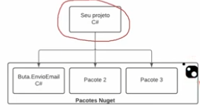
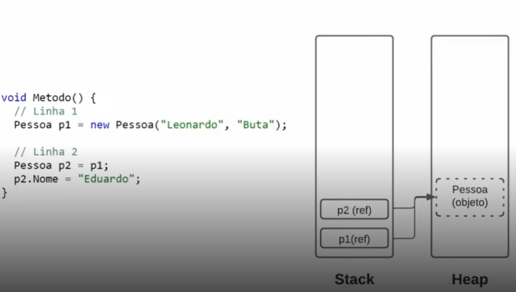

# Conhecendo a Organização de um Programa C#

## Na versão .NET5 a classe main é explicita e obrigatória:
- Método Main:

```C#
using System;

namespace ExemploFundamentos.NET5
{
    class Program
    {
        static void Main(string[] args)
        {
            Console.WriteLine("Hello World!");
        }
    }
}
```

## Já nas versões acima, exemplo .NET6 a classe main é implicita ou seja não é obrigatória, porém ela é gerada automáticamente na compilação, podendo escrever o programa direto:
- Exemplo:

```C#
Console.WriteLine("Hello World!");
```


DOTNET
|----- Program.cs

Esse arquivo é a nossa classe!

DOTNET
|----- dotnet.csproj

Esse arquivo arquivo de projeto do C# contém informações enssenciais para o projeto conhecido como metadados usando xml.
.csproj: contém informações referente a um projeto (build, debug, versão)

DOTNET
|----- .sln
Contém informações que carregam um agrupamento de projetos


DOTNET
|----- obj

Se refere aos arquivos de Debug, arquivos de compilação.

DOTNET
|----- bin

Pasta de arquivos binários, compilados, .exe, .dll e .pdb.

# Conceito de Classe


```C#
using System;
using System.Collections.Generic;
using System.Linq;
using System.Threading.Tasks;

namespace dotnet.Models
{
    public class Pessoa
    {
        public string Nome { get; set; }
        public int Idade { get; set; }

        public void Apresentar() 
        {
            Console.WriteLine($"Olá, meu nome é {Nome}, e tenho {Idade} anos");
        }
    }
}
```

# Usando namespaces

- No programa principal Program.cs, para instanciarmos a classe Pessoa iremos precisar fazer o uso de namespaces.
- Desta forma no Program.cs no inicio é necessário colocar a palavra [using] e o nome do namespace [dotnet.Models], ex:

```C#
// Criando uma nova Instancia da Classe Pessoa no Program.cs
using dotnet.Models;

Pessoa pessoa1 new Pessoa();
```

- Sendo assim podemos ter classes com o mesmo nome desde que o NameSpace seja diferente.

# Usando a classe Pessoa

```C#
// Criando uma nova Instancia da Classe Pessoa no Program.cs
using dotnet.Models;

Pessoa pessoa1 = new Pessoa();

pessoa1.Nome = "Rodrigo";
pessoa1.Idade = 18;
pessoa1.Apresentar();
```

# Cases


- Em C# se utiliza camelCase ou PascalCase.
- Nome de classes sempre em PascalCase!!!
- Nome de propriedades (atributos) da classe também em PascalCase!!!
- Nome de métodos (Funcoes, Procedimentos) da classe também em PascalCase!!!
- Nome de variáveis são em camelCase ex pessoaUm!!!
- Abreviações para os nomes de métodos, classes, propriedades e variáveis não são recomendadas em C#.
- Também não é recomendável utilizar caracteres especiais em nomes de métodos, classes, propriedades e variáveis exceto o Underline (_).
- Valores monetários é recomendável utilizar o tipo decimal.

# Tipos de dados

<br/>


# Operadores aritméticos


# Converter tipo de dados (Cast ou Casting)

- Em C# é possível fazer isso usando a classe Convert.ToInt32("5") ou também usando int.Parse("5").
- Ou seja ou usa o Convert ou usa o tipo do dado mais o método Parse().
- Isso é chamado de Cast ou Casting.
- Qual a diferença entre os dois?
    - A principal diferença entre eles é o tratamento do valores Nulos.
    - Quando se utiliza o Convert ele trata o dado do tipo nulo e converte para 0.
    - Já o método Parse gera uma Exception dando erro no programa em tempo de execução.
- Casting implícito:
```c#
int a = 5;
double b = a;
```
Isso é um Casting implícito!!!


# Operadores condicionais (if, else, switch case)

```C#
// IF e ELSE
int a = 5;
int b = 10;

if (a >= b)
{
    Console.WriteLine($"{a} é maior ou igual a {b}.");
}
else
{
    Console.WriteLine($"{a} é menor que {b}.");
}

// Podemos fazer o IF inline:
Console.WriteLine($"A é menor que B? {a > b}"); // Saída será False.

// IF Aninhado
int a = 5;
int b = 10;

if (a > b)
{
    Console.WriteLine($"{a} é maior que {b}.");
}
else if (b == a)
{
    Console.WriteLine("Os valores são iguais.");
}
else
{
    Console.WriteLine($"{a} é menor que {b}.");
}

// input no C# é Console.ReadLine(); Podemos fazer desta forma também:
Console.WriteLine("Digite uma letra:");
string letra = Console.ReadLine();

if (letra == "a" ||
    letra == "e" ||
    letra == "i" ||
    letra == "o" ||
    letra == "u")
{
    Console.WriteLine("Vogal.");
}
else
{
    Console.WriteLine("Não é Vogal.");
}

// Ou podemos fazer o switch Case
switch (letra)
{
    case "a":
    case "e":
    case "i":
    case "o":
    case "u":
        Console.WriteLine("Vogal.");
        break;
    default:
        Console.WriteLine("Não é Vogal.");
        break;
}
```

# Operadores lógicos (&&, ==, <=, >=, ||, !)

- && : E;
- == : Igualdade;
- <= : Menor ou Igual;
- >= : Maior ou Igual;
- || : Ou;
- ! :  Não;

# Incremento e Decremento

- variavel++;
- ++variavel;
- variavel--;
- --variavel;

# Estrutura de Repetição

```C#
// FOR -->

for (int i = 0; i < 3; i++)
{
    Console.Write(i + " ");
}
// Saída: 0 1 2

// ====================================================================================== //

// DO WHILE -->

bool usuarioNaoLogado = true;
do
{
    Console.WriteLine("Informe seu e-mail: ");
    string emailInformado = Console.ReadLine();
    // Lógica para verificar se o usuário está logado
    // ...
    // Se o usuário estiver logado, defina usuarioNaoLogado como false
} while (usuarioNaoLogado);

// ====================================================================================== //

// WHILE DO -->

int num = 1;
while (num <= 10)
{
    if (num % 2 == 0)
    {
        Console.Write(num + " ");
    }
    num++;
}
// Saída: 2 4 6 8 10

// ====================================================================================== //
```


# Arrays

- O array é uma estrutura de dados que armazena valores do mesmo tipo, com um tamnho fixo.

1. int[] array = new int[4];
2. int[] array = new int[]{42,75,74,61};
3. string[] nomes = {"Jan, "Fev};

- Índice: É a posição de um determinado valor de um array, sempre começando com zero.


1. int elemento = array[0];
// Elemento receberia o valor igual 42.
2. array[0] = 42;
// A posição 0 do array receberia o valor igual a 42, substituindo o valor que lá existia.


```C#
// Trabalhando com Arrays

int[] arrayInteiros = new int[3];

arrayInteiros[0] = 1;
arrayInteiros[1] = 2;
arrayInteiros[2] = 3;

Console.WriteLine("\nFOR COMUM: \n");

for (int contador = 0; contador < arrayInteiros.Length; contador++)
{
    Console.WriteLine(
        $"Posição Nº: {contador} - Valor = {arrayInteiros[contador]}"
        );
}
```

# Usando o FOREACH

- Serve para percorrer uma coleção ou listas sem a necessidade de utilizar contador, um método para facilitar percorrer listas ou coleções.

```C#
// Trabalhando com Arrays

int[] arrayInteiros = new int[3];

arrayInteiros[0] = 1;
arrayInteiros[1] = 2;
arrayInteiros[2] = 3;

Console.WriteLine("\nFOREACH: \n");

foreach(int valor in arrayInteiros)
{
    int posicao = Array.IndexOf(arrayInteiros, valor);

    Console.WriteLine(
        $"Posição Nº: {posicao} - Valor = {valor}"
    );
}

```

# Redimensionar o tamanho de um array

- Para redimensionar um array podemos usar a classe Array e seu método Resize, ex:

```C#
// Redimensionando Arrays

int[] arrayInteiros = new int[3];

arrayInteiros[0] = 1;
arrayInteiros[1] = 2;
arrayInteiros[2] = 3;

Array.Resize(ref arrayInteiros, arrayInteiros.Length * 2);
// Após está ação o arrayInteiros terá seu tamanho dobrado para arrayInteiros[8]
// Este método resize, nada mais faz que, copiar o array atual, em seguida cria um novo com um novo tamanho e coloca os valores copiados do array antigo no novo.

// Fazendo manualmente o que o método Resize faz:

int [] arrayInteirosDobrado = new int[arrayInteiros.Length * 2];
Array.Copy(arrayInteiros, arrayInteirosDobrado, arrayInteiros.Length);
```

# Usando listas em C#

- Nas listas não precisamos definir o tamanho obrigatóriamente como um array.

```C#
// Criando uma lista em C#
List<string> listaString = new List<string>();
```

# Comentários
- Os comentários servem para documentar o seu código,
explicando um determinado método ou execução.

- Auxiliam outros programadores a entender o que está acontecendo.

## Tipos de comentários em C#

- Comentários com '//' é representado em uma única linha.
- Comentários com '/*COMENTARIOS*/' é representado em várias linhas.
- Comentários com '<summary>' permite documentar classes, métodos, parâmetros, etc.

# Propiedades, métodos e Construtores

- Uma propriedade é um membro que oferece um mecanismo flexível para ler, gravar ou calcular o valor de um campo particular.

# Exemplos:

```C#

namespace PropriedadesMetodosConstrutores.Models
{
    public class Pessoa
    {
        private string _nome;
        public string Nome 
        { 
            get
            {
                return _nome.ToUpper();
            }

            set
            {
                if (value == null || value == "")
                {
                    #pragma warning disable CA2208
                    throw new ArgumentNullException("O nome não pode ser vazio.");
                    #pragma warning restore CA2208
                }
                _nome = value; // Atribuir o valor do nome após validação de vazio.
            } 
        }
        private int _idade;
        public int Idade 
        {
            get
            {
                return _idade;
            }

            set
            {
                if (value <= 0 || value > 130)
                {
                    throw new ArgumentOutOfRangeException("A idade deve estar acima de 0 e menor que 130.");
                }
                _idade = value;
            }
        }

        public void Apresentar()
        {
            Console.WriteLine(
                $"""
                Nome: {Nome}
                Idade: {Idade}
                """
            );
        }
    }
}

```

# Usando body expressions (forma resumida para ficar mais legivel o get e set)

- Quando se tem apenas uma linha podemos fazer assim: get => _nome.ToUpper();

```C#

namespace PropriedadesMetodosConstrutores.Models
{
    public class Pessoa
    {
        private string _nome;
        public string Nome 
        { 
            get => _nome.ToUpper();

            set
            {
                if (value == null || value == "")
                {
                    #pragma warning disable CA2208
                    throw new ArgumentNullException("O nome não pode ser vazio.");
                    #pragma warning restore CA2208
                }
                _nome = value; // Atribuir o valor do nome após validação de vazio.
            } 
        }
        private int _idade;
        public int Idade 
        {
            get => _idade;

            set
            {
                if (value <= 0 || value > 130)
                {
                    throw new ArgumentOutOfRangeException("A idade deve estar acima de 0 e menor que 130.");
                }
                _idade = value;
            }
        }

        public void Apresentar()
        {
            Console.WriteLine(
                $"""
                Nome: {Nome}
                Idade: {Idade}
                """
            );
        }
    }
}

```

# Diferenças entre campos e propriedades

- Campos não possuem get e set, exemplo:
    ```C#
    private string _nome;
    private int _idade;
    ```
- As propriedades possuem o get e set, exemplo:
    ```C#
    public string Nome 
    { 
        get => _nome.ToUpper(); // Usando Body Expressions

        set
        {
            if (value == null || value == "")
            {
                #pragma warning disable CA2208
                throw new ArgumentNullException("O nome não pode ser vazio.");
                #pragma warning restore CA2208
            }
            _nome = value; // Atribuir o valor do nome após validação de vazio.
        } 
    }
    public int Idade 
    {
        get => _idade; // Usando Body Expressions

        set
        {
            if (value <= 0 || value > 130)
            {
                throw new ArgumentOutOfRangeException("A idade deve estar acima de 0 e menor que 130.");
            }
            _idade = value;
        }
    }
    ```


# Tipos de encapsulamento

- public: Qualquer um pode acessar.
- private: Apenas a classe tem acesso, ou seja ela esta protegida de alterações externas.

# Métodos

- Um método é um bloco de código que contém uma série de instruções.

# Contrutores

- Os construtores permitem que o programador defina valores padrão, limite a instanciação e grave códigos flexíveis fáceis de ler.

- Por convenção vem logo após o nome da classe, e tem o mesmo nome da classe seguido de parenteses "()".

- Em C# podemos ter mais de um construtor disponivel na classe.

```C#
public class Pessoa
{
    // Construtor 1
    public Pessoa()
    {}

    // Construtor 2
    public Pessoa(
        string nome,
        string sobrenome
    )
    {
        // PROPRIEDADE = CAMPO
        Nome = nome;
        Sobrenome = sobrenome;
    }
}
```

# UML


# Representação em código do esquema UML acima

- Classe Pessoa:
```C#
using System;
using System.Collections.Generic;
using System.Linq;
using System.Threading.Tasks;

namespace PropriedadesMetodosConstrutores.Models
{
    public class Pessoa
    {

        // Construtor 1
        public Pessoa()
        {}

        // Construtor 2
        public Pessoa(
            string nome,
            string sobrenome
        )
        {
            Nome = nome;
            Sobrenome = sobrenome;
        }

        // Campos
        private string _nome;
        private int _idade;

        // Propriedades
        public string Nome 
        { 
            get => _nome.ToUpper(); // Usando Body Expressions

            set
            {
                if (value == null || value == "")
                {
                    #pragma warning disable CA2208
                    throw new ArgumentNullException("O nome não pode ser vazio.");
                    #pragma warning restore CA2208
                }
                _nome = value; // Atribuir o valor do nome após validação de vazio.
            } 
        }
        public int Idade 
        {
            get => _idade; // Usando Body Expressions

            set
            {
                if (value <= 0 || value > 130)
                {
                    throw new ArgumentOutOfRangeException("A idade deve estar acima de 0 e menor que 130.");
                }
                _idade = value;
            }
        }
        public string Sobrenome { get; set; }
        public string NomeCompleto => $"{Nome} {Sobrenome}".ToUpper();

        // Métodos
        public void Apresentar()
        {
            Console.WriteLine(
                $"""
                Nome: {NomeCompleto}
                Idade: {Idade}
                """
            );
        }
    }
}
```

- Classe Curso:
```C#
using System;
using System.Collections.Generic;
using System.Linq;
using System.Reflection.Metadata;
using System.Runtime.InteropServices.Marshalling;
using System.Threading.Tasks;
using PropriedadesMetodosConstrutores.Models;

namespace PropriedadesMetodosConstrutores.Models
{
    /// <summary>
    /// É um objeto Curso
    /// </summary>
    public class Curso
    {
        // Propriedades
        public string Nome { get; set; }
        public List<Pessoa> Alunos { get; set; }

        // Métodos
        /// <summary>
        /// Adiciona um aluno do objeto curso
        /// </summary>
        /// <param name="aluno">Parametro obrigatório, do tipo Pessoa aluno</param>
        public void AdicionarAluno(Pessoa aluno)
        {
            Alunos.Add(aluno);
        }

        /// <summary>
        /// Remove um aluno do objeto curso 
        /// </summary>
        /// <param name="aluno">Parametro obrigatório, do tipo Pessoa aluno</param>
        public void RemoverAluno(Pessoa aluno)
        {
            Alunos.Remove(aluno);
        }

        /// <summary>
        /// Lista o nome completo dos alunos matriculados no objeto curso
        /// </summary>
        public void ListarAlunos()
        {
            Console.WriteLine($"Alunos do curso de {Nome}: \n");
            foreach (Pessoa aluno in Alunos)
            {
                Console.WriteLine(aluno.NomeCompleto);
            }
        }


        /// <summary>
        /// Lista as matriculas dos alunos matriculados no objeto curso
        /// </summary>
        public void ObterAlunosMatriculados()
        {
            //TODO
        }


        /// <summary>
        /// Calcula a quantidade de alunos matriculados no objeto curso
        /// </summary>
        /// <returns>Retorna a quantidade de alunos matriculados no curso</returns>
        public int QuantidadeAlunosMatriculados()
        {
            return Alunos.Count();
        }
    }
}
```

- Programa Main:
```C#
using PropriedadesMetodosConstrutores.Models;

Pessoa p1 = new Pessoa(nome: "Rodrigo", sobrenome: "Camurça");
Pessoa p2 = new Pessoa(nome: "Eduardo", sobrenome: "Neves Queiroz");

Curso cursoDeIngles = new Curso();
cursoDeIngles.Nome = "Inglês";
cursoDeIngles.Alunos = new List<Pessoa>();

cursoDeIngles.AdicionarAluno(aluno: p1);
cursoDeIngles.AdicionarAluno(aluno: p2);

cursoDeIngles.ListarAlunos();

Console.WriteLine(
    $"""
    
    Quantidade de alunos matriculados no curso de:
    {cursoDeIngles.Nome} = {cursoDeIngles.QuantidadeAlunosMatriculados()}

    """
);
```

# Concatenação de string (Interpolação)

- Interpolação:
    ```C#
    Console.WriteLine(
                    $"""
                    Posição: {Alunos.IndexOf(aluno)+1}
                    Valor: {aluno.NomeCompleto}
                    """
                );
    ```

- Concatenação:
    ```C#
    string texto = "\nNº " + (Alunos.IndexOf(aluno)+1) + " " + aluno.NomeCompleto + "\n";


    Console.WriteLine(
        "USANDO CONCATENAÇÃO: " + texto 
    );
    ```

- Representação de formatação de Moeda:
```C#
decimal moeda = 1582.40M;
Console.WriteLine(
        $"{moeda:C}" // R$ 1.582,40
        $"{moeda:N}" // 1.582,40
        $"{moeda:C}" // R$ 1.582,4
        $"{moeda:N2}" // 1.582,4
        $"{moeda:P1}" // 1.582,4%
    ); // O que vem depois do : é o tipo de formatação C = Currency.
```

- Formatando o tipo DateTime:
```C#
DateTime data = DateTime.Now;
DateTime dataDois = DateTime.Parse("17/04/2022 18:00");
Console.WriteLine(data.ToString("dd/MM/yyyy"));
Console.WriteLine(data.ToShortDateString());
Console.WriteLine(data.ToShortTimeString());
Console.WriteLine(dataDois.ToShortDateString());
```

# Tratamento de Erros e Exceções

- Estrutura de exemplo:
    ```C#
    try
    {
        Console.WriteLine("Executa esse trecho de código, se cair em algum erro vai para o bloco abaixo do catch.");
    }
    catch(FileNotFoundException fnfe)
    {
        Console.WriteLine($"Outro tipo de erro: {fnfe.Message}");
    }
    catch(Exception ex)
    {
        Console.WriteLine($"Se cair em alguma exceção este bloco é executado. MENSAGEM DE ERRO: {ex.Message}");
    }
    finally
    {
        Console.WriteLine("O bloco finally é executado em seguida após a execução de um try ou de um catch");
    }
    ```

- Usando o Throw, que serve para lançar uma execeção:
    ```C#
    throw new Exception("Ocorreu uma exceção");
    ```

# Estruturas de dados Fila(Queue-FIFO), Pilha(Stack-LIFO) e Dictionary

- Fila:

    ```C#
    Queue<int> fila = new Queue<int>();
    fila.Enqueue(1);
    fila.Enqueue(4);
    fila.Enqueue(6);
    fila.Enqueue(8);

    foreach(int item in fila)
    {
        Console.WriteLine(item);
    }

    Console.WriteLine($"\nRemovendo o elemento: {fila.Dequeue()}\n");

    fila.Enqueue(10);

    foreach(int item in fila)
    {
        Console.WriteLine(item);
    }
    ```

- Pilha:

    ```C#
    Stack<int> pilha = new Stack<int>();

    pilha.Push(42);
    pilha.Push(75);
    pilha.Push(74);
    pilha.Push(61);

    foreach(int item in pilha)
    {
        Console.WriteLine(item);
    }

    Console.WriteLine($"\nRemovendo o elemento: {pilha.Pop()}\n");

    pilha.Push(10);

    foreach(int item in pilha)
    {
        Console.WriteLine(item);
    }
    ```

- Dictionary:

    ```C#
    Dictionary<string, string> dicionario = new Dictionary<string, string>();

    dicionario.Add("SP", "São Paulo");
    dicionario.Add("BA", "Bahia");
    dicionario.Add("MG", "Minas Gerais");

    // Removendo um valor ->
    dicionario.Remove("SP");

    foreach (var item in dicionario)
    {
        Console.WriteLine($"Chave: {item.Key} Valor: {item.Value}");
    }
    ```

# Tuplas

- Tuplas fornece sintaxe concisa para agrupar vários elementos de dados em uma estrutura de dados leve.

- Como declarar uma tupla:

    ```C#
    (int Id, string Nome, string Sobrenome) tupla = (1, "Rodrigo", "Camurça");
    ValueTuple<int, string, string> outroExemploTupla = (1, "Rodrigo", "Camurça");
    var maisUmExemplo = Tuple.Create(1, "Rodrigo", "Camurça");

    Console.WriteLine(
        $"""
        ID: {tupla.Id}
        NOME: {tupla.Nome}
        SOBRENOME: {tupla.Sobrenome}

        Outro Exemplo:
        ID: {outroExemploTupla.Item1}
        NOME: {outroExemploTupla.Item2}
        SOBRENOME: {outroExemploTupla.Item3}

        Outro Exemplo:
        ID: {maisUmExemplo.Item1}
        NOME: {maisUmExemplo.Item2}
        SOBRENOME: {maisUmExemplo.Item3}
        """
    );
    ```

# IF Ternário

```C#
var numero = 3;

Console.WriteLine($"O número {numero} é " + (numero % 2 == 0 ? "par" : "ímpar"));
```

# Nuget, serializar e atributos no C#

- Gerenciador de pacotes
    -   O que é um pacote?
        - Um pacote é um conjunto de códigos úteis, que possibilita o compartilhamento e reuso do código.

- __Nuget__ é um gerenciador de pacotes, que permite desenvolvedores compartilharem códigos e bibliotecas: 

- Instalando pacotes no VScode:
    -   dotnet add package Newtonsoft.Json --version 13.0.3

# Serialização de dados

- O que é serialização e deserialização?

- O processo de serializar consiste em transformar objetos em um fluxo de bytes para seu armazenamento ou transmissão: 

- __JSON__ JavaScript Notation Object é um formato de texto que segue a sintaxe do javascript, muito usado para transmitir dados entre aplicações.

- Exemplo de serialização:
    - 
    ```C#
    using Newtonsoft.Json;
    
    Vendas v1 = new(id: 1, produto: "Pão", preco: 25.00M);

    string serializacao = JsonConvert.SerializeObject(v1, Formatting.Indented);

    Console.WriteLine(serializacao);
    ```
    
    # Tipos especiais no C#

    - Valor nulo (nullable)
        -   Um tipo de valor nulo permite representar o tipo da variável e adicionalmente, o valor nulo.
            1. bool = true, false
            2. bool? = true, false, null
    
            ```C#
            bool? desejaReceberEmail = null;

            if(desejaReceberEmail.HasValue && desejaReceberEmail.Value)
            {
                Console.WriteLine("O usuário optou por receber e-mail.");
            }
            else
            {
                Console.WriteLine("O usuário não respondeu ou optou por não receber e-mail.");
            }
            ```
- Tipos Anônimos
    -   Os tipos anônimos fornecem um modo conveniente de encapsular propriedades somente leitura.

    ```C#
    // EXEMPLO DE TIPO ANONIMO
    var tipoAnonimo = new { Nome = "Rodrigo",  Sobrenome = "Camurça", Altura = 1.80 };

    Console.WriteLine(
    $"""

    Nome: {tipoAnonimo.Nome}
    Sobrenome: {tipoAnonimo.Sobrenome}
    Altura: {tipoAnonimo.Altura}

    """
    );
    ```
    - Outro exemplo:
    ```C#
    DateTime dataAtual = DateTime.Now;
    List<Vendas> listaDeVendas = [];
    Vendas v1 = new(id: 1, produto: "Pão", preco: 25.00M, dataVenda: dataAtual, desconto: null);
    Vendas v2 = new(id: 2, produto: "Pão Baguete", preco: 25.50M, dataVenda: dataAtual, desconto: 10M);

    // Adicionando objetos na lista
    listaDeVendas.Add(v1);
    listaDeVendas.Add(v2);

    // Extraindo propriedades especificas de um objeto
    // Criando um novo objeto de tipos anonimos
    var listaAnonima = listaDeVendas.Select(elemento => new { elemento.Produto, elemento.Preco });

    foreach (var item in listaAnonima)
    {
        Console.WriteLine(
            $"""

            Produto: {item.Produto}
            Preco: {item.Preco:C}
            """
        );
    }
    ```

- Tipo de variável Dinamica (Dynamic):
    ```C#
    // Tipo de variável Dinamica
    dynamic variavelDinamica = 4;
    variavelDinamica = " ";
    variavelDinamica = null;
    ```

- Classes genéricas
    - As classes genéricas encapsulam operações que não são específicas de um determinado tipo de dados.

    ```C#
    namespace PropriedadesMetodosConstrutores.Models
    {
        public class MeuArray<T>
        {
            private static int capacidade = 10;
            private int contador = 0;
            private T[] array = new T[capacidade];

            public void AddElementArray(T elemento)
            {
                if (contador + 1 < 11)
                {
                    array[contador] = elemento;
                }
                contador ++;
            }

            public T this[int index]
            {
                get { return array[index]; }
                set { array[index] = value; }
            }
        }
    }

    MeuArray<int> arrayInteiro = new();

    arrayInteiro.AddElementArray(30);

    Console.WriteLine(arrayInteiro[0]);

    MeuArray<string> arrayString = new();

    arrayString.AddElementArray("30");

    Console.WriteLine(arrayString[0]);
    ```

# Métodos de extensão
- Os métodos de extensão permitem que você "adicione" tipos existentes sem criar um novo tipo derivado, recompilar ou, caso contrário, modificar o tipo original.

```C#
int numero = 20;
bool par = false;

par = numero % 2 == 0;

string mensagem = "O número " + numero + " " + "é " + (par ? "par" : "ímpar");

Console.WriteLine(mensagem);
```

- Neste exemplo temos um caso onde par = numero % 2 == 0; caso seja necessário verificar em vários lugares no código, teriamos que repetir várias vezes essa expressão, para evitarmos isso vamos criar um método de extensão, vamos criar uma classe para obter esse método de extensão, será necessário fazer a criação da classe com a palavra static pois a mesma nunca será instanciada:

```C#
namespace PropriedadesMetodosConstrutores.Models
{
    public static class IntExtensions
    {
        public static bool EhPar(this int numero)
        {
            return numero % 2 == 0;
        }
    }
}

// Agora o código refatorado
int numero = 20;
bool par = false;

par = numero.EhPar();

string mensagem = "O número " + numero + " " + "é " + (par ? "par" : "ímpar");

Console.WriteLine(mensagem);
```

# Stack, Heap e Garbage Collector

- Alocação de memória:
    - Vamos entender os dois tipos de memória existentes no C#, tipos de valores e tipos de referência.

- Declaração de variável:
    ```C#
    void Metodo(){
        // Linha 1
        int a = 5;

        // Linha 2
        int b = 10;

        // Linha 3
        Pessoa p1 = new();
    }
    ```
    

- O Stack é uma pilha (LIFO) e armazena em memória RAM, a Stack é estática.

- O Heap armazena objetos que são mais complexos, a Heap é mais dinâmica.

- Garbage Collector (GC) - Limpeza de memória, ela é executada automaticamente, quando um objeto não tiver mais referencia ligada a stack o mesmo entra em ação e mata o objeto inativo.

# Tipos de valor e referência

- __Tipo de valor:__ Uma variável de um tipo de valor contém uma instância do tipo.

__Tipo de referência:__ Uma variável de um tipo de referência contém uma referência a uma instância do tipo.


- Neste exemplo abaixo, quando atribuimos um novo valor ao nome de p2 como é a mesma refencia de p1 a mudança do nome também irá ocorrer em p1:



# Desafio de projeto

- Construindo um sistema de hospedagem de um hotel no C#:


Clique aqui para acessar o [DESAFIO CONCLUÍDO!!!](https://github.com/rcvdigo/formacao_.NET_Developer/tree/main/ExemploFundamentos/DesafioProjetoHotel)

# POO, com C#

- Introdução POO, Abstração e Encapsulamento

- A POO é um paradigma de programação, ou seja corresponde a uma técnica de programação para um fim específico.

- Dentro desta técnica, existem quatro pilares:
    1. Abstração
    2. Encapsulamento
    3. Herança
    4. Polimorfismo

- O principal conceito da POO são classes e objetos!

- Um paradigma nada mais é do que um modelo de técnicas, estruturas e formas de solucionar um problema.

- Paradigma de programação é diferente de linguagem de programação!

- Uma linguagem de programação implementa um ou mais paradigmas.

- Alguns exemplos de paradigmas de programação:

    1. Programação orientada a objetos
    2. Programação estruturada
    3. Programação imperativa
    4. Programação procedural
    5. Programação orientada a eventos
    6. Programação lógica

# Abstração

- Abstrair um objeto do mundo real para um contexto específico, considerando apenas os atributos importantes.

    ```mermaid
    classDiagram
        class Pessoa {
            + Nome: String
            + Idade: Int
            + apresentar() void
        }
    ```

# Encapsulamento

- O encapsulamento serve para proteger uma classe e definir limites para alteração de suas propriedades.

- Serve para ocultar seu comportamento e expor somente o necessário.
    ```mermaid
    classDiagram
        class ContaCorrente {
            + Numero: int
            - Saldo: decimal
            + Sacar(decimal valor) void
        }
    ```

# Herança

- A herança nos permite reutilizar atributos, métodos e comportamentos de um classe em outras classes.

- Serve para agrupar objetos que são do mesmo tipo, porém com características diferentes.

    ```mermaid
    classDiagram
        class Aluno {
            + Nome: string
            + Idade: int
            + Nota: double
            + Apresentar() void
        }

        class Professor {
            + Nome: string
            + Idade: int
            + Salario: decimal
            + Apresentar() void
        }
    ```
- Neste caso acima podemos verificar que atributos e métodos se repetem, sendo assim a boa prática diz que não devemos repetir códigos. Sendo assim teremos que usar o conceito de herança para atendermos este requisito.

- Então vamos criar uma nova classe chamada Pessoa onde Aluno e Professor herdam seus atributos e métodos:

    ```mermaid
    classDiagram

        Pessoa <|-- Aluno
        Pessoa <|-- Professor
        class Pessoa {
            + Nome: string
            + Idade: int
            + Apresentar() void
        }

        class Aluno {
            + Nota: double
        }

        class Professor {
            + Salario: decimal
        }
    ```

# Polimorfismo

- O polimorfismo vem do grego e significa "Muitas Formas".

- Com o polimorfismo, podemos sobrescrever métodos das classes filhas para que se comportem de maneira diferente e ter su própria implementação.

- Para sobrescrever um método em uma classe herdada se faz necessário ir a classe pai e colocar a palavra reservada virtual, assim podemos sobreescrever um método de uma classe que herdamos.

    ```C#
    using System;
    using System.Collections.Generic;
    using System.Linq;
    using System.Threading.Tasks;

    namespace POO.Models
    {
        public class Pessoa(string nome, int idade)
        {
            public string Nome { get; set; } = nome;
            public int Idade { get; set; } = idade;

            public virtual void Apresentar()
            {
                Console.WriteLine($"Olá, meu nome é {Nome} e tenho {Idade} anos!");
            }
        }
    }
    ```
- Para implementar o polimorfismo na classe filha usamos a palavra override, ex:

    ```C#
    using System;
    using System.Collections.Generic;
    using System.Linq;
    using System.Threading.Tasks;

    namespace POO.Models
    {
        public class Professor(string nome, int idade, decimal salario) : Pessoa(nome, idade)
        {
            public decimal Salario { get; set; } = salario;
        
            public override void Apresentar()
            {
                Console.WriteLine($"Olá, meu nome é {Nome} e tenho {Idade} anos, e sou um aluno nota {Nota}!");
            }
        }
    }
    ```

# Classe abstrata

- Uma classe abstrata tem como objetivo ser exclusivamente um modelo para ser herdado, portanto não pode ser instanciada.

- Você pode implementar métodos ou deixá-los a cargo de quem herdar.

    ```mermaid
    classDiagram

        Conta --|> Corrente

        class Conta {
            <<Abstract>>
            - Saldo: double
            + Creditar(decimal valor) <_Abstract>
            + ExibirSaldo() void
        }

        class Corrente {
            - Tarifa: double
            + Creditar() void
        }

    ```

    ```C#
    // Representação do diagrama acima em C#

    // Classe abstrata:

    using System;
    using System.Collections.Generic;
    using System.Linq;
    using System.Threading.Tasks;

    namespace POO.Models
    {
        public abstract class Conta
        {
            protected decimal saldo;

            public abstract void Creditar(decimal valor);

            public void ExibirSaldo()
            {
                Console.WriteLine($"O seu saldo é {saldo:C}");
            }
        }
    }

    // Classe que herda a classe abstrata

    using System;
    using System.Collections.Generic;
    using System.Linq;
    using System.Threading.Tasks;

    namespace POO.Models
    {
        public class Corrente : Conta
        {
            public override void Creditar(decimal valor)
            {
                saldo += valor;
            }
        }
    }
    ```

# Classe selada

- Uma classe selada tem como objetivo de impedir que outras classes façam uma herança dela, ou seja nenhuma classe pode ser sua derivada.
Também existem métodos e propriedades seladas.


# Classe object

- A classe System.Object é a mãe de todas as classes na hierarquia do .NET.
- Todas as classes derivam, direta ou indiretamente da classe Object, e ela tem como objetivo prover serviços de baixo nível para suas classes filhas.

# Interfaces

- Uma interface é um contrato que pode ser implementado por uma classe.
- É como se fosse uma classe abstrata, podendo definir métodos abstratos para serem implementados.
- Assim como uma classe abstrata, uma interface não pode ser instanciada.

```C#
// Interface Calculadora

using System;
using System.Collections.Generic;
using System.Linq;
using System.Threading.Tasks;

namespace POO.interfaces
{
    public interface ICalculadora
    {
        int Somar(int num1, int num2);
        int Subtrair(int num1, int num2);
        int Multiplicar(int num1, int num2);
        int Dividir(int num1, int num2);
    }
}

// Classe Calculadora Implementa a Interface Calculadora

using System;
using System.Collections.Generic;
using System.Linq;
using System.Threading.Tasks;
using POO.interfaces;

namespace POO.Models
{
    public class Calculadora : ICalculadora
    {
        public int Dividir(int num1, int num2)
        {
            return num1 / num2;
        }

        public int Multiplicar(int num1, int num2)
        {
            return num1 * num2;
        }

        public int Somar(int num1, int num2)
        {
            return num1 + num2;

        }
        public int Somar(int num1, int num2, int num3)
        {
            return num1 + num2 + num3;
        }

        public int Subtrair(int num1, int num2)
        {
            return num1 - num2;
        }
    }
}
```

# O que é uma API

- Uma API (Application Programming Interface) é uma forma de comunicação entre computadores ou programas de computadores.
Em outras palavras, é um software que fornece informações para outro software.


- Vamos criar uma nova API no .NET.

```C#
// Criação de um novo projeto webapi
$\ dotnet new webapi
// Executar o servidor de desenvolvimento de api
$\ dotnet watch run
```

- Uma Controller nada mais é que uma classe que vai agrupar todos nossos endpoints e requisições HTTP.

- Agora vamos fazer a instalação do pacote EntityFramework para podermos utilizar ORM.

```C#
// Instalação do Entity Framework
$\ dotnet tool install --global dotnet-ef

// Instalação do Pacote
$\ dotnet add package Microsoft.EntityFrameworkCore.Design

// Instalação do Pacote SQLSERVER
$\ dotnet add package Microsoft.EntityFrameworkCore.SqlServer
```

- Após fazer a criação das Entities e o Context no C# devemos executar as Migrations que serve para transcrever de código C# para o contexto de Banco de Dados relacional.

```C#
// Execução das Migrations
$\ dotnet-ef migrations add CriacaoTabelaContato

// Após a criação das migrations precisamos aplicar a criação das tabelas no banco de dados com o comando
$\ dotnet-ef database update
```

# O padrão MVC

- O padrão de arquitetura MVC(Model View Controller) separa um aplicativo em três grupos de componentes principais:

1. Modelos
2. Exibições
3. Componentes

- Esse padrão ajuda a obter a separação de interesses.

# Criando um projeto MVC ASP.NET

```C#
$\ dotnet new mvc

// Instalação do pacote para conexão com o banco de dados SQLserver
$\ dotnet add package Microsoft.EntityFrameworkCore.SqlServer

// Intalação do pacote Design
$\ dotnet add package Microsoft.EntityFrameworkCore.Design
```